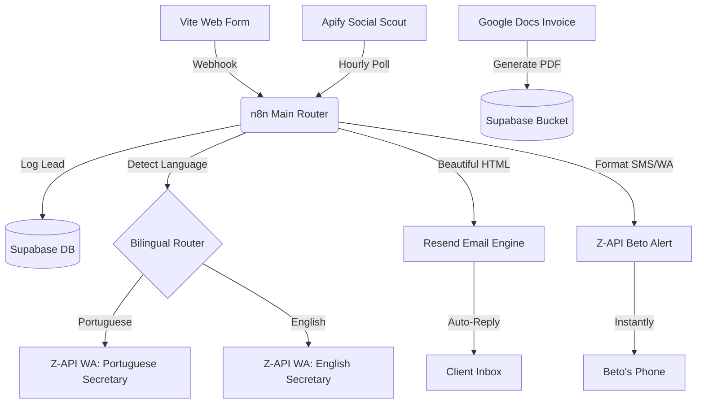

# B.F.O Property Maintenance - Operations Automation Blueprint

This document outlines the strategic and technical blueprint to transform **B.F.O Property Maintenance** from a standard trade contractor into a fully automated, high-converting digital service operation. 

Developed in collaboration with the **Hormozi Squad** (Value Architecture) and the **Data Squad** (Technical Flow & Integrity).

---

## 🐝 PART 1: The "Category of One" Grand Slam Offer
*Designed by the Hormozi Squad*

To make this automation service an absolute no-brainer for B.F.O., we frame it through the lens of the **Value Equation**:

$$\text{Value} = \frac{\text{Dream Outcome} \times \text{Perceived Likelihood of Achievement}}{\text{Time Delay} \times \text{Effort \& Sacrifice}}$$

### 1. The Dream Outcome
Beto doesn't want "n8n workflows" or "database tables." **Beto wants more local jobs, zero administrative headaches, and professional, high-end credibility with local UK clients (Ely, Soham, Cambridge) in both English and Portuguese.** 
*   **The Promise**: *"The Hands-Off Trade Machine."* You do the physical work; your automated backend captures leads, translates details, follows up instantly, issues invoices, and monitors the internet for local handyman jobs 24/7.

### 2. Eliminating Friction (The Denominator)
*   **Time Delay**: Down to **under 2 seconds**. When a client fills out the website form, the WhatsApp Secretary responds instantly.
*   **Effort & Sacrifice**: Zero. Beto does not need to learn any software. Everything lands directly on his personal phone with ready-to-click phone numbers and clean details.

---

### 📦 The BFO Operations Value Stack

We bundle this into a proprietary offer rather than generic hourly automation consulting:

| Module / Bonus | Standalone Value | Description / Objection Solved |
| :--- | :--- | :--- |
| **Core: The 2-Second WhatsApp Secretary** | **£1,200** | Instant webhook catcher, bilingual parser, and automated WhatsApp follow-up to client + direct alert to Beto. |
| **Bonus 1: Branded Client Onboarding (Resend)** | **£600** | Beautifully styled HTML email auto-replies matching the brand design system, establishing immediate high credibility. |
| **Bonus 2: One-Click PDF Invoice Hub** | **£1,500** | Generates professional PDFs automatically from Google Docs templates, stores them in Supabase, and emails them with a click. |
| **Bonus 3: Apify Social Scout (Local Lead Gen)** | **£2,000** | Monitors Facebook Groups, Google Maps, and local classified sites for keywords like *"handyman Ely"*, *"painter Soham"* to notify Beto first. |
| **Bonus 4: Operational Integrity Dashboard** | **£800** | A secure logs and leads dashboard showing all activity, ensuring zero lost messages or system failures. |
| **TOTAL VALUE** | **£6,100** | **Grand Slam Package Offer** |

---

## 📊 PART 2: Technical Flow & System Integration
*Designed by the Data Squad*

To achieve absolute operational resilience, we utilize a robust **Clean Separation Backend Architecture** using your self-hosted n8n instance, Supabase DB, Z-API, Resend, and Apify.



### 1. Module A: The 2-Second WhatsApp Secretary (Z-API + n8n)
*   **How it works**:
    1. A lead submits a form on [bfopropertymaintenance.co.uk](https://bfopropertymaintenance.co.uk).
    2. n8n captures the webhook, writes to Supabase, and detects the client's language preference.
    3. **WhatsApp Secretary Client Hook**: Sends a highly personalized message using the dedicated BFO virtual assistant number:
       *   *EN*: *"Hello {Name}! Thank you for contacting B.F.O Property Maintenance. Beto has received your request regarding '{Service}'. He is currently on-site but will review your details shortly. We've sent a detailed summary to your email ({Email})."*
       *   *PT*: *"Olá {Name}! Obrigado por entrar em contato com a B.F.O Property Maintenance. O Beto já recebeu o seu pedido sobre '{Service}'. Ele está em atendimento de campo no momento, mas analisará os detalhes em breve. Enviamos um resumo para o seu e-mail ({Email})."*
    4. **Beto Alert Hook**: Sends a direct WhatsApp notification to Beto:
       *   *"🚨 **NEW BFO LEAD!** Name: {Name} | Phone: {Phone} | Service: {Service} | Message: {Message} | Click to call instantly: https://wa.me/{Phone}"*

### 2. Module B: Branded Client Onboarding (Resend Emails)
*   **How it works**:
    *   Instead of generic plain-text emails, n8n formats a beautiful, responsive HTML email utilizing the BFO design system (warm charcoal background, gold accents, crisp Outfit typography).
    *   Sent via **Resend API** from `hello@bfopropertymaintenance.co.uk` or a custom sub-domain.
    *   Includes a beautiful project review link or a greeting card showing Beto's actual craftsmanship photos, reinforcing trust.

### 3. Module C: One-Click PDF Invoice & Quote Hub (Google Docs + Supabase)
*   **How it works**:
    1. Beto enters the client's name, description, and price inside a simplified Google Form or dedicated Google Sheet row.
    2. n8n triggers automatically:
       *   Reads a beautifully branded **Google Doc Template** with BFO's header, terms, and billing details.
       *   Replaces tags like `{{CLIENT_NAME}}`, `{{DATE}}`, `{{ITEMS}}`, and `{{TOTAL_PRICE}}`.
       *   Exports the Google Doc as a secure **PDF** using Google Drive API.
       *   Uploads the PDF to a secure **Supabase Storage Bucket** (`invoices/`).
       *   Logs the invoice details (amount, status, PDF url) to the `invoices` table.
       *   Sends the PDF link directly to the customer via **Resend Email** and a short **Z-API WhatsApp message**: *"Hi {Name}, your invoice/quote from B.F.O is ready. Click to view: {PDF_URL}"*

### 4. Module D: Apify Social Scout (Local Lead Gen)
*   **How it works**:
    1. We configure the **Apify Google Maps Scraper** or **Apify Facebook Groups Scraper** (using global API credentials).
    2. n8n runs a cron scheduler every 4 hours.
    3. Apify scans local community groups (e.g., "Ely Community", "Soham Noticeboard", "Cambridge Trades") searching for matching buyer keywords:
       *   `handyman`, `painter`, `decorating`, `fence repair`, `trim painting`, `fit kitchen`, `decking`.
    4. When a match is found, n8n filters out duplicates and sends an instant alert to Beto:
       *   *"💡 **Scout Alert!** User '{User}' just posted in Facebook Group: 'Need a reliable painter in Soham to redo my trim.' Click to view post and reply: {Post_URL}"*
    5. This positions Beto to be the **first contractor** to pitch, securing high-ticket jobs before competitors even see the request.

### 5. Module E: The Google Sheets 2-Way CRM Sync (Frictionless Mobile Management)
*   **How it works**:
    1. Every time a new lead is logged in Supabase, n8n automatically formats a row and appends it to a centralized Google Sheet dashboard inside Beto's Google Workspace.
    2. The sheet is formatted with dropdown statuses (`New`, `Contacted`, `Quoted`, `Completed`, `Lost`) and an `Internal Notes` column.
    3. Beto can update statuses or add notes on his phone while on-site. n8n triggers on sheet changes and synchronizes the updates directly back to the Supabase database.
    4. Provides a zero-learning-curve, high-speed mobile interface for Beto.

### 6. Module F: The Premium React Vite Admin Portal (Subdomain Portal)
*   **How it works**:
    1. We scaffold a highly aesthetic, responsive Single Page Application (SPA) built using React, Tailwind CSS, Lucide icons, and the Supabase Client SDK inside `BFO_Automations/bfo-dashboard/`.
    2. The portal is protected behind **Supabase Magic Link / OTP Email Authentication** (no passwords to remember, extremely secure).
    3. Beto and you can view business-critical metrics (leads count, outstanding invoices, financial conversion charts), manage leads inside a custom Kanban board, trigger invoice PDFs, and audit the system health through visual operational logs.
    4. **Replicability**: The portal connects directly to Supabase with zero custom backend servers. Cloning it for other trade clients requires changing just the Supabase URL and key inside a `.env` file and deploying to Netlify for free.

---

## 🗄️ PART 3: The Supabase Operational Database Schema
*Designed by the Data Squad*

To support all automation flows with bulletproof data integrity, we establish three clean tables inside your Supabase instance: `leads`, `invoices`, and `audit_logs`.

### 1. The `leads` Table
Stores contact and service details for customer analytics and easy follow-ups.

```sql
CREATE TABLE public.leads (
    id UUID DEFAULT gen_random_uuid() PRIMARY KEY,
    name VARCHAR(255) NOT NULL,
    email VARCHAR(255) NOT NULL,
    phone VARCHAR(50),
    service_type VARCHAR(100),
    message TEXT,
    language VARCHAR(10) DEFAULT 'en', -- 'en' or 'pt'
    source VARCHAR(100) DEFAULT 'website', -- 'website', 'facebook', 'manual'
    status VARCHAR(50) DEFAULT 'new', -- 'new', 'contacted', 'quoted', 'completed', 'lost'
    created_at TIMESTAMP WITH TIME ZONE DEFAULT timezone('utc'::text, now()) NOT NULL
);
```

### 2. The `invoices` Table
Logs financial records and links to generated billing PDFs.

```sql
CREATE TABLE public.invoices (
    id UUID DEFAULT gen_random_uuid() PRIMARY KEY,
    lead_id UUID REFERENCES public.leads(id) ON DELETE SET NULL,
    invoice_number VARCHAR(100) UNIQUE NOT NULL,
    amount NUMERIC(10, 2) NOT NULL,
    status VARCHAR(50) DEFAULT 'unpaid', -- 'unpaid', 'paid', 'overdue', 'cancelled'
    pdf_url TEXT, -- Link to Supabase Storage PDF
    issued_date DATE DEFAULT CURRENT_DATE NOT NULL,
    due_date DATE NOT NULL,
    created_at TIMESTAMP WITH TIME ZONE DEFAULT timezone('utc'::text, now()) NOT NULL
);
```

### 3. The `audit_logs` Table
A highly critical log table tracking every webhook, message sent, and API error. If Z-API, Resend, or Google API fails, the Data Chief can diagnose the issue instantly.

```sql
CREATE TABLE public.audit_logs (
    id UUID DEFAULT gen_random_uuid() PRIMARY KEY,
    event_type VARCHAR(100) NOT NULL, -- 'webhook_received', 'wa_sent', 'email_failed', 'pdf_created'
    payload JSONB, -- Full API response or error traceback
    status VARCHAR(50) NOT NULL, -- 'success', 'error', 'pending'
    created_at TIMESTAMP WITH TIME ZONE DEFAULT timezone('utc'::text, now()) NOT NULL
);
```

---

## 🚀 PART 4: Phase-by-Phase Execution Roadmap

```text
 PHASE 1: DB & LOGS SCAFFOLD (COMPLETED)
 ├── [x] Run SQL migrations in Supabase to create bfo_leads, bfo_invoices, and bfo_audit_logs tables with RLS enabled.
 ├── [x] Rename schema column service_type to service_raw to match Vite frontend.
 └── [x] Update frontend code (src/lib/supabase.ts) to direct form submissions to bfo_leads.

 PHASE 2: n8n 2-WAY GOOGLE SHEETS & WHATSAPP SECRETARY TRIGGERS (IN PROGRESS)
 ├── [ ] Set up the master Google Sheet template inside Google Workspace.
 ├── [ ] Configure self-hosted n8n webhook triggers and bilingual message-routing scripts.
 ├── [ ] Implement 2-way sync: (Supabase -> Google Sheets) and (Google Sheets edits -> Supabase).
 ├── [ ] Integrate Z-API credentials inside credentials/ folder.
 ├── [ ] Develop beautifully formatted Resend HTML email templates.
 └── [ ] Export finalized n8n workflows as JSON files to BFO_Automations/n8n_workflows/.

 PHASE 3: REPLICABLE REACT VITE ADMIN PORTAL
 ├── [ ] Scaffold a lightweight React + Tailwind Vite SPA in BFO_Automations/bfo-dashboard/.
 ├── [ ] Integrate Supabase JS SDK client with magic link OTP email login.
 ├── [ ] Build dashboard analytics cards, Pipeline Kanban Board, and audit log viewer.
 └── [ ] Deploy CRM portal to production (e.g. portal.bfopropertymaintenance.co.uk) on Netlify.

 PHASE 4: ONE-CLICK PDF INVOICING & APIFY SCOUT
 ├── [ ] Configure Google Doc quote/invoice template and n8n PDF export webhook.
 └── [ ] Authenticate Apify and set up cron schedulers for automated local lead scraping.
```
